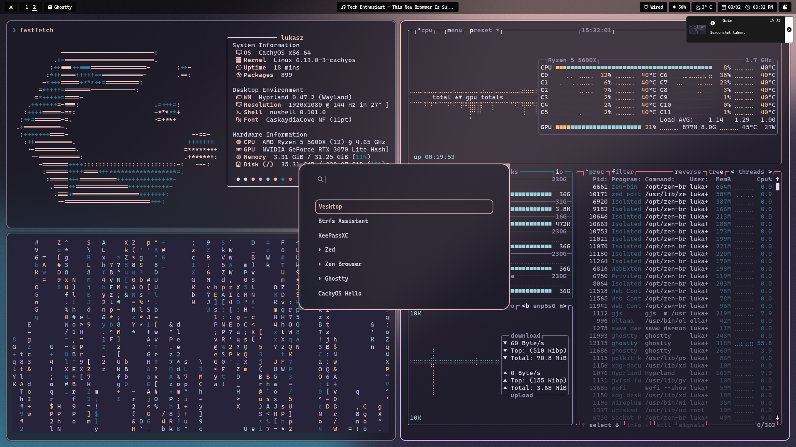

# Łukasz Ciszewski' dotfiles 📜

Config for my awesome hyprland setup on [CachyOS](https://cachyos.org/).


## Requirements

Ensure you have the following installed on your system

### Git

```
pacman -S git
```

### Stow

```
pacman -S stow
```

## Installation

First, check out the dotfiles repo in your $HOME directory using git

```
$ git clone https://github.com/lciszewski27/dotfiles.git
$ cd dotfiles
```

then use GNU stow to create symlinks

```
$ stow .
```
